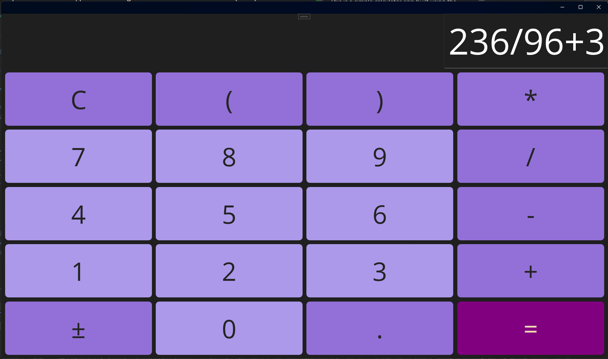
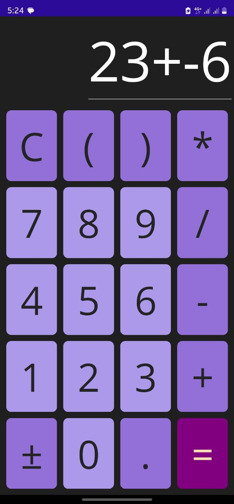

# CalculatorMAUI

This is a simple calculator app built in MAUI using the Model-View-ViewModel (MVVM) architectural pattern.

## MVVM (Model-View-ViewModel)

MVVM is a software architectural pattern that separates the user interface (View) from the business logic (Model) by introducing a middle layer called ViewModel. It promotes separation of concerns and improves the testability and maintainability of the code.

In MVVM, the Model represents the data and business logic of the application. It encapsulates the data and provides methods to manipulate and retrieve it.

The View is responsible for displaying the user interface to the user. It interacts with the ViewModel to bind the data and update the UI based on the changes in the ViewModel.

The ViewModel acts as a bridge between the View and the Model. It exposes properties and commands that the View can bind to, and it handles the logic and data manipulation required by the View. It also notifies the View of any changes in the data, allowing the UI to update accordingly.

By following the MVVM pattern, the code becomes more modular and easier to maintain. It also enables better separation of concerns, making it easier to test and reuse the code.

## Features

- Supports complex arithmetic expressions following the order of operations (BODMAS)
- Clear button to reset the calculator
- Responsive UI for different screen sizes

| Desktop | Mobile |
| --- | --- |
|  |  |

## Getting Started

To run the CalculatorMAUI app, follow these steps:

1. Clone the repository.
2. Open the solution in Visual Studio.
3. Build and run the app to your preferred platform (iOS, Android, Windows, Mac, etc).

## Contributing

Contributions are welcome! Here are some ways you can contribute:
- Report bugs and make suggestions for improvements by creating an issue.
- Fork the repository and submit a pull request for any features or bug fixes.
- Most importantly, have fun!

## License

This project is licensed under the [MIT License](LICENSE.txt).

Project Created Using [MAUI App Accelerator](https://github.com/mrlacey/MauiAppAccelerator)